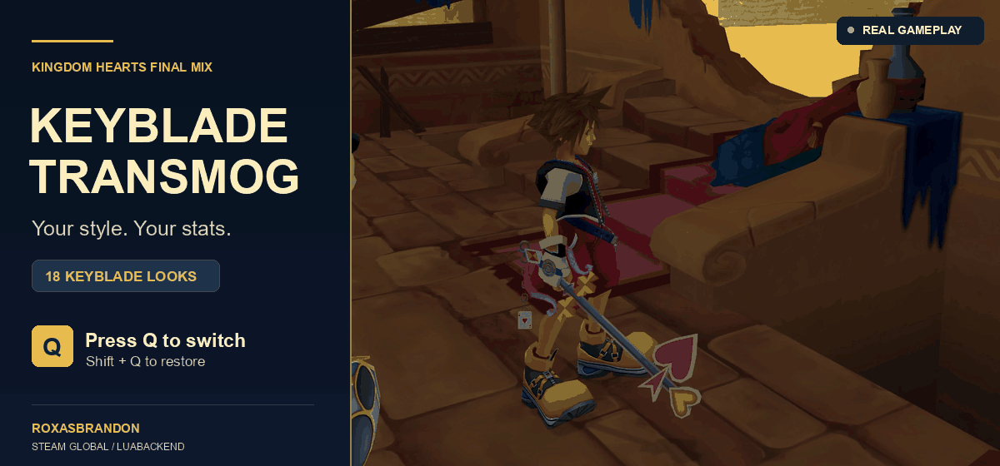

# Keyblade Transmog

[Download v0.1.12 preview](https://github.com/ROXASBrandon/KH1FM-Keyblade-Transmog/raw/refs/heads/main/downloads/Keyblade-Transmog-v0.1.12-preview.zip) · [Report a bug](https://github.com/ROXASBrandon/KH1FM-Keyblade-Transmog/issues)

**Version 0.1.12 preview — ROXASBrandon**

**Tested in gameplay on the author's setup.** All 18 appearances, battle swaps,
equipped stats/abilities, matching hit sounds, Shift+Q reset, room transitions,
save/reload, and a fresh restart passed the final gameplay checks.

**Known limitation:** each accepted swap briefly pauses gameplay while the new
weapon loads. Presses during swings or movement are ignored. Appearance selection
resets after restarting the game; your equipped weapon and save remain unchanged.

For Kingdom Hearts Final Mix, Steam Global/WW 1.0.0.2 with LuaBackend.

During ordinary gameplay, press **Q** once to cycle through the 18 standard
Final Mix Keyblade appearances **and their matching hit sounds**. Hold **Shift** and press **Q** to restore the
currently equipped weapon's original appearance and sounds. Holding Q does not cycle.
All appearances are available without granting any weapons to your inventory.
The first Q press selects the appearance after your equipped weapon in the list.

The selected cosmetic blade supplies its model, sound bank, and hit-sound IDs.
For example, equip Jungle King and show Oathkeeper: it looks and sounds like
Oathkeeper while Jungle King supplies your combat stats.

Your actual equipped weapon remains the source of strength, MP, critical
behavior, reach, and other weapon parameters. For example, equip Oblivion and
show Kingdom Key: Oblivion remains equipped and supplies its stats. Changing
equipment normally changes the stat source while keeping your selected skin.

Appearance selection lasts for this game session. It is not written into your
save. Restarting restores vanilla appearances. Dream weapons, Wooden Sword,
and special story equipment are excluded. Cosmetic selection is suspended
while these are equipped. Cutscenes with independently loaded props may show
their scripted weapons.

## Install

Close KH1 normally before installing or replacing the native helper.

- **Manual:** copy `scripts/kh1_keyblade_transmog.lua` into LuaBackend's KH1
  script folder, and `scripts/io_packages/kh1_transmog.dll` into its
  `io_packages` subfolder. Keep both in the same script root.
- **OpenKH / GitHub:** select KH1 in Mods Manager, choose **Mods > Install new
  mods**, and enter `ROXASBrandon/KH1FM-Keyblade-Transmog`. Install, enable, then
  **Mod Loader > Build and Run**. Alternatively import the preview ZIP.
  The manifest copies both required files. For updates, check for mod updates
  and rebuild your KH1 mod list after closing the game.

Use one install method only. Restart KH1. F2 opens LuaBackend's console; look
for `[Keyblade Transmog] Ready`. Q is added without consuming or changing the
game's existing keyboard binding. If Q already has a game action assigned,
rebind that action in the game's settings to avoid doing both at once.

Swapping briefly pauses gameplay while the new weapon model and sound bank load.
A briefly absent blade can occur during loading. Gameplay resumes after the
replacement weapon is attached and ready.

Q requires 300 ms of standing idle with a valid weapon. Presses during attacks,
movement, casting, or another swap are ignored and never queued. Stop moving or
attacking, wait briefly, then press Q again. Inputs in menus, cutscenes, gummi
travel, death, or outside the focused game are ignored. Release and press Q again
after returning to gameplay.

## Remove

Close KH1 normally. Remove this script and its `io_packages/kh1_transmog.dll`,
or disable the OpenKH mod and rebuild. Restart. The native frame hook remains
loaded until process exit, so deleting a script or pressing F3 alone does not
disable this mod. Do not replace the DLL while the game is running.

## Compatibility and testing

Version 0.1.12 passed the author's final gameplay checks on Steam Global/WW
1.0.0.2: all 18 appearances in battle, different equipped weapons with their
stats/abilities retained, Shift+Q reset, room transitions, save/reload, a fresh
restart, and matching hit sounds. The brief pause during a swap remains expected.

Automated checks cover all 324 equipped/appearance pairs, unchanged combat
fields, exact restoration, input handling, delayed loading, native scheduler
hooks, companion audio progression, and room submission during reload. The
packaged helper matches the tested installed DLL. Other PCs and installation
through OpenKH Mods Manager have not been tested live; this remains a preview.

Model replacement mods editing the same Keyblade names are not supported;
stat-only modifications are preserved. Other game versions disable this mod.
No game assets, saves, account details, or game binaries are included. This mod
does not edit game archives or save files.

See [development notes](DEVELOPMENT.md) for the native reload guard and prior
crash investigations. Versions before 0.1.12 are superseded; use the current
linked download.

## Build from source

The ZIP includes helper source, core regression test, and standalone builder.
Install Python 3 and `ziglang==0.16.0`, then run `python native/build.py` from
the extracted package. It runs the core test and creates the Windows x64 helper
at `scripts/io_packages/kh1_transmog.dll`. Windows also runs the native
capture/apply/restore integration test. This works from Windows or Linux/WSL.
Building does not install files into the game.

## My other mods

- [Treasure Magnet Starter](https://github.com/ROXASBrandon/KH1FM-Treasure-Magnet-Starter) — early unlock, zero AP.
- [Treasure Magnet Vacuum](https://github.com/ROXASBrandon/KH1FM-Treasure-Magnet-Vacuum) — 500x pickup range for items and HP/MP/munny orbs.

See [credits](CREDITS.md) and [changelog](CHANGELOG.md).
