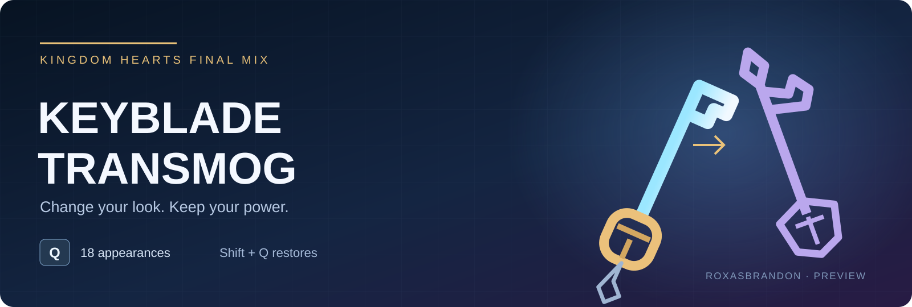

# Keyblade Transmog

[Download v0.1.2 preview](https://github.com/ROXASBrandon/KH1FM-Keyblade-Transmog/raw/refs/heads/main/downloads/Keyblade-Transmog-v0.1.2-preview.zip) · [Report a bug](https://github.com/ROXASBrandon/KH1FM-Keyblade-Transmog/issues)

**Version 0.1.2 preview — ROXASBrandon**

For Kingdom Hearts Final Mix, Steam Global/WW 1.0.0.2 with LuaBackend.

During ordinary gameplay, press **Q** once to cycle through the 18 standard
Final Mix Keyblade appearances. Hold **Shift** and press **Q** to restore the
currently equipped weapon's original appearance. Holding Q does not cycle.
All appearances are available without granting any weapons to your inventory.
The first Q press selects the appearance after your equipped weapon in the list.

Your actual equipped weapon remains the source of strength, MP, critical
behavior, reach, and other weapon parameters. For example, equip Oblivion and
show Kingdom Key: Oblivion remains equipped and supplies its stats. Changing
equipment normally changes the stat source while keeping your selected skin.

Appearance selection lasts for this game session. It is not written into your
save. Restarting restores vanilla appearances. Dream weapons, Wooden Sword,
and special story equipment are excluded. Cosmetic selection is suspended
while these are equipped. Cutscenes with independently loaded props may show
their scripted weapons.

## Install

Close KH1 normally before installing or replacing the native helper.

- **Manual:** copy `scripts/kh1_keyblade_transmog.lua` into LuaBackend's KH1
  script folder, and `scripts/io_packages/kh1_transmog.dll` into its
  `io_packages` subfolder. Keep both in the same script root.
- **OpenKH / GitHub:** select KH1 in Mods Manager, choose **Mods > Install new
  mods**, and enter `ROXASBrandon/KH1FM-Keyblade-Transmog`. Install, enable, then
  **Mod Loader > Build and Run**. Alternatively import the preview ZIP.
  The manifest copies both required files. For updates, check for mod updates
  and rebuild your KH1 mod list after closing the game.

Use one install method only. Restart KH1. F2 opens LuaBackend's console; look
for `[Keyblade Transmog] Ready`. Q is added without consuming or changing the
game's existing keyboard binding. If Q already has a game action assigned,
rebind that action in the game's settings to avoid doing both at once.

Swapping briefly reloads the weapon through the game's asynchronous loader.
Inputs during another weapon load or within 200 ms of a previous swap are
ignored. Inputs in menus, cutscenes, gummi travel, death, or outside the focused
game are ignored. Release and press Q again after returning to gameplay.

## Remove

Close KH1 normally. Remove this script and its `io_packages/kh1_transmog.dll`,
or disable the OpenKH mod and rebuild. Restart. The native frame hook remains
loaded until process exit, so deleting a script or pressing F3 alone does not
disable this mod. Do not replace the DLL while the game is running.

## Validation boundary

**Preview: Q appearance switching has been confirmed working in gameplay.**
Source was traced against the supported local executable. Model table layout,
frame-hook signature, vanilla equip/loading path, and all 18 asset names were
checked. Automated tests cover cosmetic-field isolation, unchanged stat bytes,
exact restoration, cycle wrap, and keyboard edge detection. Build and package
checks passed. A live memory check also confirmed Jungle King remained equipped
while showing Oathkeeper, with the combat-field checksum unchanged. Room
transitions also retain the selected appearance, confirmed in gameplay.
Version 0.1.2 fixes the reported missing hit sounds by retaining the equipped
weapon's sound bank; that fix still needs in-game audio verification.

A clean restart using the ZIP-installed 0.1.2 helper, other equipped weapons,
hit sounds, death/continue, and removal still need explicit gameplay
verification before labeling this a stable release. Other PCs and OpenKH
ZIP installation have not been tested live.

Model replacement mods editing the same Keyblade names are not supported;
stat-only modifications are preserved. Other game versions disable this mod.

First test in a safe room: press Q, check the visible blade, open Equipment to
confirm the original item, then test a different equipped Keyblade. Also check
combat, room transitions, death/continue, and Shift+Q. If the model vanishes,
freezes, or stats differ, close normally and remove the preview before saving.

No game models, saves, account details, or game binaries are included. This
mod does not edit game archives or save files. The native helper only edits
model-name fields and the graphics cache, and redirects two sound filename
formatting calls to the original equipped names. Sound IDs remain unchanged. The game's normal re-equip routine
is called with the same item ID to refresh the displayed weapon.

## Build from source

The ZIP includes helper source, core regression test, and standalone builder.
Install Python 3 and `ziglang==0.16.0`, then run `python native/build.py` from
the extracted package. It runs the core test and creates the Windows x64 helper
at `scripts/io_packages/kh1_transmog.dll`. This works from Windows or Linux/WSL.
Building does not install files into the game.

## Related mods

- [Treasure Magnet Starter](https://github.com/ROXASBrandon/KH1FM-Treasure-Magnet-Starter) — early unlock, zero AP.
- [Treasure Magnet Vacuum](https://github.com/ROXASBrandon/KH1FM-Treasure-Magnet-Vacuum) — expanded pickup range.

See [credits](CREDITS.md) and [changelog](CHANGELOG.md).
